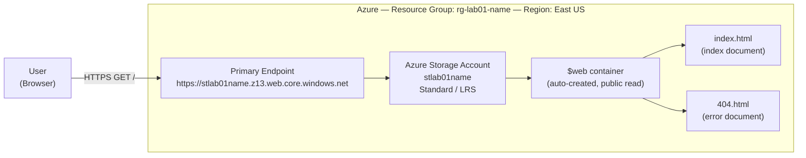
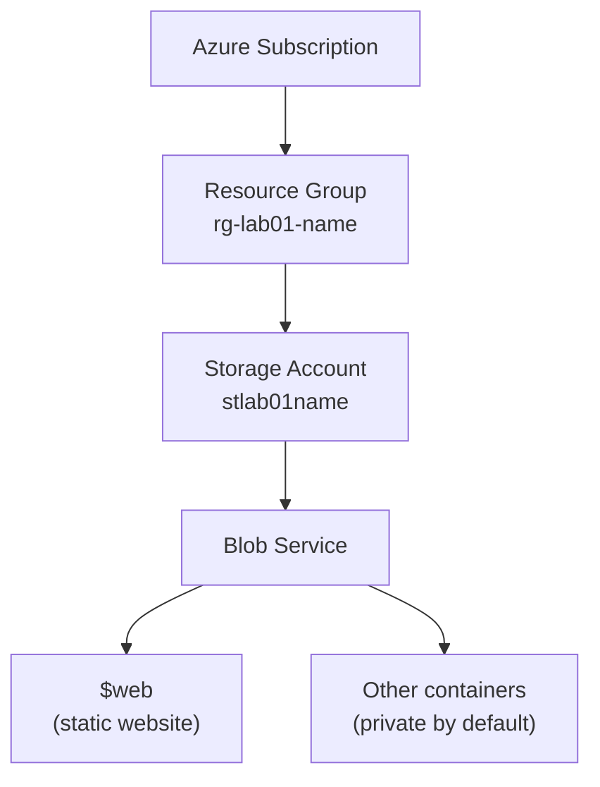

# Lab 01 — Static Website Hosting on Azure Blob Storage

Deploying a public, serverless static site using **Azure Blob Storage** static website hosting — no virtual machines, no web server, no patching.

| | |
|---|---|
| **Cloud** | Microsoft Azure |
| **Services** | Storage Account (Blob), Resource Group |
| **Completed by** | `Fabrizio Mastrogiovanni` |

---

## 1. Objective

Host a public-facing website without provisioning or managing a server.

Traditionally this requires a virtual machine (VM), a web server (NGINX/IIS), an operating system to patch, and a network to secure. Azure Blob Storage's **static website** feature removes all of that: you upload files, Azure serves them over HTTPS. This is a **PaaS (Platform as a Service)** pattern — you own the content, Microsoft owns the infrastructure underneath it.

**What this lab demonstrates:**
- Resource organization using Resource Groups
- Storage Account provisioning and redundancy selection
- Static website hosting and the auto-provisioned `$web` container
- Public endpoint validation
- Cost hygiene via full resource cleanup

---

## 2. Architecture

### Request flow



The trust boundary sits at the endpoint: everything inside the `$web` container is anonymously readable from the public internet. Nothing else in the storage account is exposed by enabling this feature — other containers keep their own access level.

### Resource hierarchy



Deleting the Resource Group deletes everything beneath it — this is the cleanup mechanism in Section 8.

---

## 3. Prerequisites

- [ ] Active Azure Subscription (Free Tier is sufficient)
- [ ] A text editor (VS Code, Notepad, TextEdit)
- [ ] *(Optional)* [Azure CLI](https://learn.microsoft.com/cli/azure/install-azure-cli) if you want to follow the CLI path in Section 6

---

## 4. Naming convention

Consistent names make resources searchable, scriptable, and easy to clean up. Replace `[yourname]` throughout.

| Resource | Value | Constraints |
|---|---|---|
| Resource Group | `rg-lab01-[yourname]` | — |
| Region | `East US` | Keep all resources in one region |
| Storage Account | `stlab01[yourname]` | **Globally unique**, 3–24 chars, lowercase letters and numbers only |

> Storage account names are part of a public DNS name (`<name>.blob.core.windows.net`), which is why they must be unique across all of Azure — not just your subscription.

---

## 5. Deployment — Azure Portal

### Phase 1 — Create the Resource Group

1. Sign in to the [Azure Portal](https://portal.azure.com).
2. Search **Resource groups** → **+ Create**.
3. **Subscription:** your subscription
   **Resource group:** `rg-lab01-[yourname]`
   **Region:** `(US) East US`
4. **Review + create** → **Create**.

A Resource Group is a logical container and a lifecycle boundary. Everything in this lab goes inside it so a single delete removes all of it.

### Phase 2 — Create the Storage Account

1. Search **Storage accounts** → **+ Create**.
2. Configure the **Basics** tab:

   | Setting | Value | Why |
   |---|---|---|
   | Resource group | `rg-lab01-[yourname]` | Keeps lifecycle contained |
   | Storage account name | `stlab01[yourname]` | Lowercase alphanumeric only |
   | Region | `(US) East US` | Match the Resource Group |
   | Performance | `Standard` | General-purpose, HDD-backed; Premium is unnecessary here |
   | Redundancy | `Locally-redundant storage (LRS)` | 3 copies in one datacenter — cheapest, adequate for a lab |

3. **Review + create** → wait for validation → **Create**.
4. When deployment completes (~30s), click **Go to resource**.

> **Redundancy note:** LRS survives a rack or drive failure, not a datacenter outage. Production sites would use ZRS (zone-redundant) or GRS (geo-redundant). LRS is chosen here purely for cost.

### Phase 3 — Enable static website hosting

1. In the Storage Account menu, under **Data management**, select **Static website**.
2. Toggle **Static website** to **Enabled**.
3. **Index document name:** `index.html`
4. **Error document path:** `404.html`
5. **Save**.

Azure now displays a **Primary endpoint** — for example
`https://stlab01[yourname].z13.web.core.windows.net/`

**Copy this URL.** It is the public address of your site. Saving also auto-creates the `$web` container.

### Phase 4 — Create the site file

Save the following as `index.html` (exact lowercase filename):

```html
<!DOCTYPE html>
<html>
<head>
    <title>My First Cloud Site</title>
    <style>
        body { font-family: sans-serif; text-align: center; margin-top: 50px; background-color: #f0f0f0; }
        h1 { color: #0078d4; }
    </style>
</head>
<body>
    <h1>Hello from the Cloud!</h1>
    <p>This site is hosted on Azure Blob Storage.</p>
    <p>Deployed by: [Your Name]</p>
</body>
</html>
```

### Phase 5 — Upload content

1. Storage Account menu → **Containers** (under **Data storage**).
2. Open the `$web` container.
3. **Upload** → select `index.html` → **Upload**.

### Phase 6 — Validate

1. Open a new browser tab.
2. Paste the **Primary endpoint** URL from Phase 3.
3. You should see **"Hello from the Cloud!"**

Deployment complete.

---

## 6. Deployment — Azure CLI (equivalent path)

Same result, reproducible and scriptable. Replace `yourname` before running.

```bash
# Variables
NAME="yourname"
RG="rg-lab01-$NAME"
STORAGE="stlab01$NAME"
LOCATION="eastus"

# Sign in
az login

# 1. Resource Group
az group create \
  --name "$RG" \
  --location "$LOCATION"

# 2. Storage Account (Standard, LRS)
az storage account create \
  --name "$STORAGE" \
  --resource-group "$RG" \
  --location "$LOCATION" \
  --sku Standard_LRS \
  --kind StorageV2

# 3. Enable static website hosting (creates $web automatically)
az storage blob service-properties update \
  --account-name "$STORAGE" \
  --static-website \
  --index-document index.html \
  --404-document 404.html

# 4. Upload site content
az storage blob upload \
  --account-name "$STORAGE" \
  --container-name '$web' \
  --name index.html \
  --file ./index.html \
  --auth-mode login \
  --overwrite

# 5. Retrieve the public endpoint
az storage account show \
  --name "$STORAGE" \
  --resource-group "$RG" \
  --query "primaryEndpoints.web" \
  --output tsv
```

> `--auth-mode login` uses your Entra ID (formerly Azure AD) identity instead of an account key. Prefer this over key-based auth — see Section 7.

---

## 7. Security considerations

The lab works as written, but here is what a production deployment would change:

| Consideration | Lab state | Production guidance |
|---|---|---|
| **Public exposure** | `$web` is anonymously readable by anyone with the URL | Expected for a public site — but confirm no other container is set to public access |
| **Authentication for uploads** | Portal upload uses your signed-in identity | Use Entra ID / RBAC (`Storage Blob Data Contributor`) and disable shared key access: `--allow-shared-key-access false` |
| **Transport** | HTTPS enforced by default on the endpoint | Keep "Secure transfer required" enabled; never disable it |
| **Custom domain + TLS** | Uses the `*.web.core.windows.net` endpoint | Front with Azure CDN or Front Door for a custom domain, managed TLS certificate, and WAF |
| **Content integrity** | Manual upload | Deploy from CI/CD (GitHub Actions) so the site is reproducible from source |
| **Logging** | Not enabled | Enable Storage Analytics / diagnostic settings to Log Analytics for read patterns and anomalies |
| **Cost exposure** | LRS, deleted after lab | Set a budget alert on the subscription; egress bandwidth is the main variable cost |

> **Key takeaway:** enabling static website hosting makes *only* the `$web` container public. It does not change access on any other container. Verify before assuming.

---

## 8. Troubleshooting

| Symptom | Cause | Fix |
|---|---|---|
| `404 - The requested content does not exist.` | Filename case mismatch | Azure is case-sensitive. The file must be exactly `index.html` — not `Index.html` or `index.html.txt` |
| `404` with a correct filename | Uploaded to the wrong container | Content must be in `$web`, not `documents`, `data`, or any other container |
| `Storage account name is already taken` | Names are globally unique across Azure | Append digits: `stlab01yourname99` |
| `Static website` blade missing | Wrong account kind | Requires `StorageV2` (general-purpose v2) or BlockBlobStorage — legacy v1 does not support it |
| Old content still served | Browser or CDN cache | Hard refresh (`Ctrl+Shift+R` / `Cmd+Shift+R`) or open in a private window |
| Endpoint returns nothing | Using the *blob* endpoint, not the *web* endpoint | The correct URL contains `.web.core.windows.net`, not `.blob.core.windows.net` |

---

## 9. Cleanup

Always tear down lab resources. Deleting the Resource Group removes every resource inside it.

**Portal:** Resource groups → `rg-lab01-[yourname]` → **Delete resource group** → type the name to confirm → **Delete**.

**CLI:**

```bash
az group delete --name "rg-lab01-$NAME" --yes --no-wait
```

Verify it is gone:

```bash
az group exists --name "rg-lab01-$NAME"   # should return: false
```

---

## 10. Repository structure

```
.
├── README.md           # This document
├── src/
│   ├── index.html      # Site content
│   └── 404.html        # Error page
└── scripts/
    ├── deploy.sh       # CLI deployment (Section 6)
    └── cleanup.sh      # Teardown (Section 9)
```

---

## 11. What I learned

- **Resource Groups are a lifecycle boundary**, not just a folder — one delete removes the entire lab footprint, which is the simplest cost control available.
- **Serverless is not "no infrastructure," it's "someone else's infrastructure."** The trade-off is losing server-level control in exchange for zero patching and zero capacity planning.
- **Storage account names are globally unique because they resolve to public DNS**, which explains the naming constraints rather than making them feel arbitrary.
- **Enabling static website hosting scopes public access to `$web` only** — a useful default that limits blast radius.
- **Redundancy is a deliberate cost/availability decision**, not a checkbox: LRS protects against hardware failure, ZRS/GRS against zone or regional failure.

---

## 12. Next steps

- [ ] Add a custom domain with Azure CDN or Front Door and a managed TLS certificate
- [ ] Automate deployment with GitHub Actions on push to `main`
- [ ] Disable shared key access and deploy using a federated identity (OIDC) — no secrets in the repo
- [ ] Enable diagnostic logging to Log Analytics and build a basic access dashboard
- [ ] Add a budget alert on the subscription

---

## References

- [Static website hosting in Azure Storage](https://learn.microsoft.com/azure/storage/blobs/storage-blob-static-website)
- [Host a static website — how-to](https://learn.microsoft.com/azure/storage/blobs/storage-blob-static-website-how-to)
- [Azure Storage redundancy](https://learn.microsoft.com/azure/storage/common/storage-redundancy)
- [Authorize access to blobs with Entra ID](https://learn.microsoft.com/azure/storage/blobs/authorize-access-azure-active-directory)