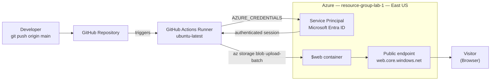
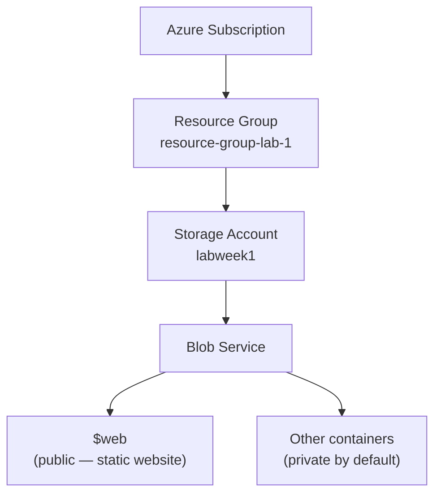
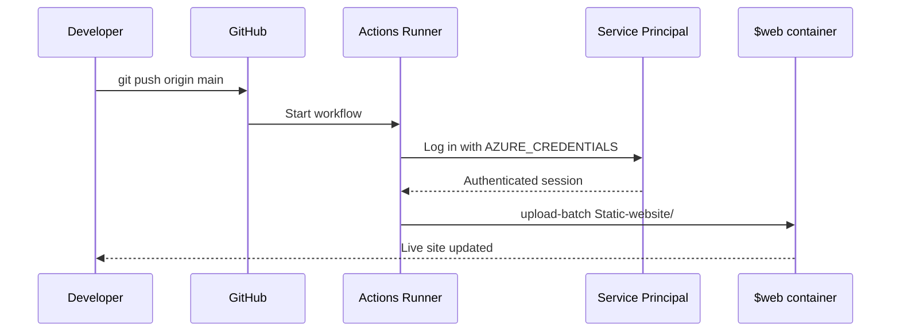

# ☁️ Azure Static Website + CI/CD Pipeline

**Azure Blob Storage · GitHub Actions · Automated Deployment**

A public static website hosted on Azure Blob Storage — no virtual machines, no web server, no patching — starting from a manual deployment and ending with a fully automated pipeline where every push to `main` updates the live site.

| | |
|---|---|
| **Cloud** | Microsoft Azure |
| **Services** | Storage Account (Blob), Resource Group, Microsoft Entra ID |
| **CI/CD** | GitHub Actions |
| **Live site** | https://labweek1.z13.web.core.windows.net/ |
| **Author** | Fabrizio Mastrogiovanni |

## 🎥 Watch me build this

👉 https://www.loom.com/share/09a10913c28643e2997294f8a72aaa5e

---

## 📌 Overview

Hosting a website traditionally means a virtual machine (VM), a web server (NGINX/IIS), an operating system to patch, and a network to secure. Azure Blob Storage's **static website** feature removes all of it: you upload files, Azure serves them over HTTPS.

This project goes one step further and removes the manual upload too.

**What it demonstrates:**

- Resource organization and lifecycle control with Resource Groups
- Storage Account provisioning and redundancy selection
- Static website hosting and the auto-provisioned `$web` container
- Service principal authentication for a non-human identity
- Push-to-deploy automation with GitHub Actions

---

## 🏗️ Architecture

### Deployment flow



### Repository structure

```
Azure-static-website-github-actions
│
├── Static-website/
│     ├── index.html          # Site content
│     └── profile.jpg         # Profile photo
│
├── .github/workflows/
│     └── deploy.yml          # CI/CD workflow
│
└── README.md
```

Pushing to `main` triggers `deploy.yml`, which uploads everything in `Static-website/` to the Azure `$web` container.

### Resource hierarchy



The trust boundary sits at the endpoint: everything inside `$web` is anonymously readable from the internet. Enabling static website hosting does **not** change access on any other container.

---

## ⚙️ Tech stack

- Microsoft Azure Blob Storage (static website hosting)
- Microsoft Entra ID (service principal)
- Azure CLI
- GitHub Actions + GitHub Secrets
- HTML / CSS

---

## 🚀 Part 1 — Manual deployment

The baseline environment, built by hand before any automation existed.

### Naming convention

| Resource | Value | Constraints |
|---|---|---|
| Resource Group | `resource-group-lab-1` | — |
| Region | `East US` | Keep everything in one region |
| Storage Account | `labweek1` | **Globally unique**, 3–24 chars, lowercase alphanumeric only |

> Storage account names resolve to public DNS (`<name>.blob.core.windows.net`), which is why they must be unique across all of Azure — not just your subscription.

### Steps

**1. Create the Resource Group**
Azure Portal → **Resource groups** → **+ Create** → name `resource-group-lab-1`, region `(US) East US`.

A Resource Group is a lifecycle boundary, not just a folder. One delete removes the entire lab footprint.

**2. Create the Storage Account**
**Storage accounts** → **+ Create**:

| Setting | Value | Why |
|---|---|---|
| Resource group | `resource-group-lab-1` | Keeps lifecycle contained |
| Performance | `Standard` | Premium is unnecessary for static files |
| Redundancy | `Locally-redundant storage (LRS)` | 3 copies in one datacenter — cheapest option |

> **Redundancy note:** LRS survives a drive or rack failure, not a datacenter outage. Production would use ZRS or GRS. LRS is chosen here purely for cost.

**3. Enable static website hosting**
Storage Account → **Data management → Static website** → **Enabled**
Index document: `index.html` · Error document: `404.html` → **Save**

Azure creates the `$web` container automatically and displays the **Primary endpoint**. That URL is the public address of the site.

**4. Upload and validate**
**Containers → `$web` → Upload** → select `index.html` → open the Primary endpoint in a browser.

The site is live. Every future change, however, would mean uploading files by hand — which is exactly what Part 3 fixes.

### CLI equivalent

```bash
RG="resource-group-lab-1"
STORAGE="labweek1"
LOCATION="eastus"

az login

az group create --name "$RG" --location "$LOCATION"

az storage account create \
  --name "$STORAGE" \
  --resource-group "$RG" \
  --location "$LOCATION" \
  --sku Standard_LRS \
  --kind StorageV2

az storage blob service-properties update \
  --account-name "$STORAGE" \
  --static-website \
  --index-document index.html \
  --404-document 404.html

az storage account show \
  --name "$STORAGE" \
  --resource-group "$RG" \
  --query "primaryEndpoints.web" -o tsv
```

---

## 🔐 Part 2 — Authorization setup

GitHub Actions runs on a machine that has never seen your Azure account. It needs an identity of its own.

This project uses a **service principal** — a non-human identity in Microsoft Entra ID that the pipeline logs in as. Its credentials are stored as encrypted GitHub Actions secrets, never committed to the repository.

### Secrets used

| Secret | What it is | Where it comes from |
|---|---|---|
| `AZURE_CREDENTIALS` | Service principal JSON used by `azure/login` | Generated with the CLI command below |
| `AZURE_STORAGE_KEY` | Storage account access key used by the upload step | Storage account → **Security + networking → Access keys** |

### Create the service principal

```bash
RG="resource-group-lab-1"
SUB=$(az account show --query id -o tsv)

az ad sp create-for-rbac \
  --name "gh-actions-azure-static-site" \
  --role "Storage Blob Data Contributor" \
  --scopes "/subscriptions/$SUB/resourceGroups/$RG" \
  --sdk-auth
```

Copy the full JSON output into **Settings → Secrets and variables → Actions → New repository secret** as `AZURE_CREDENTIALS`.

Then grab the storage key from the Portal and add it as `AZURE_STORAGE_KEY`.

The service principal appears afterwards under **Microsoft Entra ID → App registrations**.

### What I'd improve next

Both secrets here are **long-lived credentials**. The storage key in particular grants full control over the entire storage account, never expires on its own, and has to be rotated manually.

The stronger pattern is **OpenID Connect (OIDC) federated credentials**: Azure trusts a short-lived token that GitHub mints per workflow run, bound to this repository and this branch. Nothing is stored in GitHub at all, and a leaked token is useless anywhere else.

That's the upgrade path for this project, and the reason it matters:

| | Storage account key | OIDC federated identity |
|---|---|---|
| Lifetime | Until manually rotated | Minutes, per workflow run |
| Scope | Full control of the storage account | One role, one scope |
| Stored in GitHub | Yes | Nothing stored |
| If leaked | Full data-plane access | Useless outside this repo and branch |

---

## 🤖 Part 3 — CI/CD pipeline

**Trigger:** push to `main`

The full workflow lives in [`.github/workflows/deploy.yml`](.github/workflows/deploy.yml).

**What each step does:**

1. **Checkout** — the runner starts empty; this pulls the repo onto it
2. **Azure Login** — signs in as the service principal using `AZURE_CREDENTIALS`
3. **Upload** — syncs `Static-website/` into `$web` using `AZURE_STORAGE_KEY`, overwriting changed files
4. **Done** — the live site reflects the commit

> `--source` must match your actual folder name exactly. Pointing it at the repo root uploads `.git`, `.github`, and the README to your public site — a mistake worth avoiding.

---

## 🧪 Part 4 — Testing the pipeline (video demo)

The proof that automation works is a change made in GitHub appearing on the live site without ever opening the Azure Portal.

### The demo change

Add this to `Static-website/index.html`, just above the `<footer>` tag:

```html
<div class="deploy-badge">
  <span class="dot"></span>
  Deployed by GitHub Actions
</div>
```

And this inside the `<style>` block, just above the `footer {` rule:

```css
.deploy-badge {
  display: inline-flex;
  align-items: center;
  gap: 8px;
  margin-top: 28px;
  padding: 8px 14px;
  background: #eaf4fd;
  border: 1px solid #b8ddf7;
  border-radius: 999px;
  color: #0a5a9e;
  font-size: 0.78rem;
  font-weight: 600;
}

.deploy-badge .dot {
  width: 7px;
  height: 7px;
  border-radius: 50%;
  background: #16a34a;
  box-shadow: 0 0 0 3px rgba(22,163,74,0.18);
  animation: pulse 2s ease-in-out infinite;
}

@keyframes pulse {
  0%, 100% { box-shadow: 0 0 0 3px rgba(22,163,74,0.18); }
  50%      { box-shadow: 0 0 0 7px rgba(22,163,74,0.05); }
}

@media (prefers-reduced-motion: reduce) {
  .deploy-badge .dot { animation: none; }
}
```

Without the CSS the badge still renders, just as plain text — the styles are what turn it into the pill with the pulsing status dot.

### Deploy it

```bash
git add .
git commit -m "Add deploy badge"
git push
```

**What happens next:**

1. GitHub Actions starts the workflow automatically
2. The runner signs in to Azure as the service principal
3. Files upload to `$web`
4. Refreshing the live site shows the change — no Portal, no manual upload



> **Recording tips:** hard refresh (`Cmd+Shift+R` / `Ctrl+Shift+R`) or use a private window — caching will otherwise show the old page. And wait for the Actions run to go green before refreshing; the job takes 30–60 seconds.

---

## 👨🏻‍💻 Author

**Fabrizio Mastrogiovanni** — Cloud Engineer

- GitHub: https://github.com/fabrizio-mastrogiovanni
- LinkedIn: https://www.linkedin.com/in/fabrizio-mastrogiovanni-499335276/

---

## 📚 References

- [Static website hosting in Azure Storage](https://learn.microsoft.com/azure/storage/blobs/storage-blob-static-website)
- [Create an Azure service principal with the CLI](https://learn.microsoft.com/cli/azure/azure-cli-sp-tutorial-1)
- [azure/login GitHub Action](https://github.com/Azure/login)
- [Using secrets in GitHub Actions](https://docs.github.com/actions/security-guides/using-secrets-in-github-actions)
- [Configure a federated identity credential](https://learn.microsoft.com/entra/workload-id/workload-identity-federation-create-trust)
