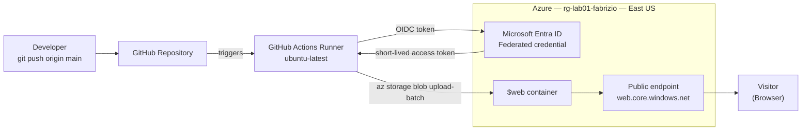
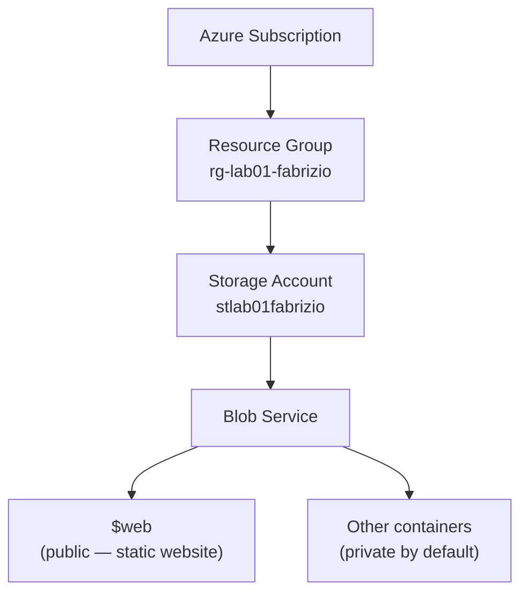
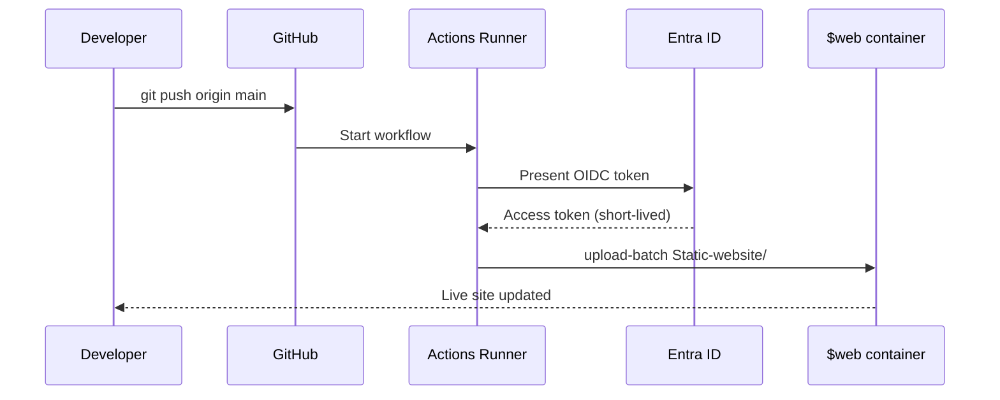

# ☁️ Azure Static Website + CI/CD Pipeline

**Azure Blob Storage · GitHub Actions · Automated Deployment**

A public static website hosted on Azure Blob Storage — no virtual machines, no web server, no patching — starting from a manual deployment and ending with a fully automated pipeline where every push to `main` updates the live site.

| | |
|---|---|
| **Cloud** | Microsoft Azure |
| **Services** | Storage Account (Blob), Resource Group, Microsoft Entra ID |
| **CI/CD** | GitHub Actions |
| **Live site** | https://labweek1.z13.web.core.windows.net/ |
| **Author** | Fabrizio Mastrogiovanni |

## 🎥 Watch me build this

👉 https://www.loom.com/share/09a10913c28643e2997294f8a72aaa5e

---

## 📌 Overview

Hosting a website traditionally means a virtual machine (VM), a web server (NGINX/IIS), an operating system to patch, and a network to secure. Azure Blob Storage's **static website** feature removes all of it: you upload files, Azure serves them over HTTPS.

This project goes one step further and removes the manual upload too.

**What it demonstrates:**

- Resource organization and lifecycle control with Resource Groups
- Storage Account provisioning and redundancy selection
- Static website hosting and the auto-provisioned `$web` container
- Workload identity authentication — no long-lived secrets in the repository
- Push-to-deploy automation with GitHub Actions

---

## 🏗️ Architecture

### Deployment flow



### Repository structure

```
azure-static-website-cicd
│
├── Static-website/
│     ├── index.html          # Site content
│     └── profile.jpg         # Profile photo
│
├── .github/workflows/
│     └── deploy.yml          # CI/CD workflow
│
└── README.md
```

Pushing to `main` triggers `deploy.yml`, which uploads everything in `Static-website/` to the Azure `$web` container.

### Resource hierarchy



The trust boundary sits at the endpoint: everything inside `$web` is anonymously readable from the internet. Enabling static website hosting does **not** change access on any other container.

---

## ⚙️ Tech stack

- Microsoft Azure Blob Storage (static website hosting)
- Microsoft Entra ID (service principal + federated credentials)
- Azure CLI
- GitHub Actions
- HTML / CSS

---

## 🚀 Part 1 — Manual deployment

The baseline environment, built by hand before any automation existed.

### Naming convention

| Resource | Value | Constraints |
|---|---|---|
| Resource Group | `rg-lab01-fabrizio` | — |
| Region | `East US` | Keep everything in one region |
| Storage Account | `stlab01fabrizio` | **Globally unique**, 3–24 chars, lowercase alphanumeric only |

> Storage account names resolve to public DNS (`<name>.blob.core.windows.net`), which is why they must be unique across all of Azure — not just your subscription.

### Steps

**1. Create the Resource Group**
Azure Portal → **Resource groups** → **+ Create** → name `rg-lab01-fabrizio`, region `(US) East US`.

A Resource Group is a lifecycle boundary, not just a folder. One delete removes the entire lab footprint.

**2. Create the Storage Account**
**Storage accounts** → **+ Create**:

| Setting | Value | Why |
|---|---|---|
| Resource group | `rg-lab01-fabrizio` | Keeps lifecycle contained |
| Performance | `Standard` | Premium is unnecessary for static files |
| Redundancy | `Locally-redundant storage (LRS)` | 3 copies in one datacenter — cheapest option |

> **Redundancy note:** LRS survives a drive or rack failure, not a datacenter outage. Production would use ZRS or GRS. LRS is chosen here purely for cost.

**3. Enable static website hosting**
Storage Account → **Data management → Static website** → **Enabled**
Index document: `index.html` · Error document: `404.html` → **Save**

Azure creates the `$web` container automatically and displays the **Primary endpoint**. That URL is the public address of the site.

**4. Upload and validate**
**Containers → `$web` → Upload** → select `index.html` → open the Primary endpoint in a browser.

The site is live. Every future change, however, would mean uploading files by hand — which is exactly what Part 3 fixes.

### CLI equivalent

```bash
NAME="fabrizio"
RG="rg-lab01-$NAME"
STORAGE="stlab01$NAME"
LOCATION="eastus"

az login

az group create --name "$RG" --location "$LOCATION"

az storage account create \
  --name "$STORAGE" \
  --resource-group "$RG" \
  --location "$LOCATION" \
  --sku Standard_LRS \
  --kind StorageV2

az storage blob service-properties update \
  --account-name "$STORAGE" \
  --static-website \
  --index-document index.html \
  --404-document 404.html

az storage account show \
  --name "$STORAGE" \
  --resource-group "$RG" \
  --query "primaryEndpoints.web" -o tsv
```

---

## 🔐 Part 2 — Authorization setup

GitHub Actions runs on a machine that has never seen your Azure account. It needs an identity.

This project uses **OpenID Connect (OIDC) federated credentials**: GitHub mints a short-lived token for each workflow run, and Azure trusts it only when it comes from this repository on this branch. No client secret, no storage account key, nothing long-lived stored in GitHub.

### One-time setup (Azure Cloud Shell)

```bash
RG="rg-lab01-fabrizio"
SA="stlab01fabrizio"
APP="gh-actions-azure-static-site"
REPO="YOUR-GITHUB-USER/YOUR-REPO"
SUB=$(az account show --query id -o tsv)

# 1. App registration + service principal
APP_ID=$(az ad app create --display-name "$APP" --query appId -o tsv)
az ad sp create --id "$APP_ID"

# 2. Trust GitHub's token — only this repo, only the main branch
az ad app federated-credential create --id "$APP_ID" --parameters "{
  \"name\": \"gh-main\",
  \"issuer\": \"https://token.actions.githubusercontent.com\",
  \"subject\": \"repo:$REPO:ref:refs/heads/main\",
  \"audiences\": [\"api://AzureADTokenExchange\"]
}"

# 3. Least-privilege role, scoped to this storage account only
az role assignment create \
  --assignee "$APP_ID" \
  --role "Storage Blob Data Contributor" \
  --scope "/subscriptions/$SUB/resourceGroups/$RG/providers/Microsoft.Storage/storageAccounts/$SA"

# 4. Values for GitHub
echo "AZURE_CLIENT_ID:       $APP_ID"
echo "AZURE_TENANT_ID:       $(az account show --query tenantId -o tsv)"
echo "AZURE_SUBSCRIPTION_ID: $SUB"
```

Add those three under **Settings → Secrets and variables → Actions → Variables**. They are identifiers, not credentials, so they belong in Variables rather than Secrets.

---

## 🤖 Part 3 — CI/CD pipeline

**Trigger:** push to `main`, or a manual run from the Actions tab

The full workflow lives in [`.github/workflows/deploy.yml`](.github/workflows/deploy.yml).

**What each step does:**

1. **Checkout** — the runner starts empty; this pulls the repo onto it
2. **Azure Login** — exchanges GitHub's OIDC token for an Azure access token
3. **Upload** — syncs `Static-website/` into `$web`, overwriting changed files
4. **Output** — prints the live URL to the run summary

`--auth-mode login` uses the federated identity from step 2 rather than an account key.

> `SOURCE_DIR` must match your actual folder name exactly. If your files live in `src/`, change it there.

---

## 🧪 Part 4 — Testing the pipeline (video demo)

The proof that automation works is a change made in GitHub appearing on the live site without ever opening the Azure Portal.

### The demo change

Add this to `Static-website/index.html`, just above the `<footer>` tag:

```html
<div class="deploy-badge">
  <span class="dot"></span>
  Deployed by GitHub Actions
</div>
```

And this inside the `<style>` block, just above the `footer {` rule:

```css
.deploy-badge {
  display: inline-flex;
  align-items: center;
  gap: 8px;
  margin-top: 28px;
  padding: 8px 14px;
  background: #eaf4fd;
  border: 1px solid #b8ddf7;
  border-radius: 999px;
  color: #0a5a9e;
  font-size: 0.78rem;
  font-weight: 600;
}

.deploy-badge .dot {
  width: 7px;
  height: 7px;
  border-radius: 50%;
  background: #16a34a;
  box-shadow: 0 0 0 3px rgba(22,163,74,0.18);
  animation: pulse 2s ease-in-out infinite;
}

@keyframes pulse {
  0%, 100% { box-shadow: 0 0 0 3px rgba(22,163,74,0.18); }
  50%      { box-shadow: 0 0 0 7px rgba(22,163,74,0.05); }
}

@media (prefers-reduced-motion: reduce) {
  .deploy-badge .dot { animation: none; }
}
```

Without the CSS the badge still renders, just as plain text — the styles are what turn it into the pill with the pulsing status dot.

### Deploy it

```bash
git add .
git commit -m "Add deploy badge"
git push
```

**What happens next:**

1. GitHub Actions starts the workflow automatically
2. The runner authenticates to Azure via OIDC
3. Files upload to `$web`
4. Refreshing the live site shows the change — no Portal, no manual upload



> **Recording tips:** hard refresh (`Cmd+Shift+R` / `Ctrl+Shift+R`) or use a private window — caching will otherwise show the old page. And wait for the Actions run to go green before refreshing; the job takes 30–60 seconds.

---

## 👨🏻‍💻 Author

**Fabrizio Mastrogiovanni** — Cloud Engineer

- GitHub: https://github.com/fabrizio-mastrogiovanni
- LinkedIn: https://www.linkedin.com/in/fabrizio-mastrogiovanni-499335276/

---

## 📚 References

- [Static website hosting in Azure Storage](https://learn.microsoft.com/azure/storage/blobs/storage-blob-static-website)
- [Configure a federated identity credential](https://learn.microsoft.com/entra/workload-id/workload-identity-federation-create-trust)
- [azure/login GitHub Action](https://github.com/Azure/login)
- [Authorize blob access with Entra ID](https://learn.microsoft.com/azure/storage/blobs/authorize-access-azure-active-directory)
